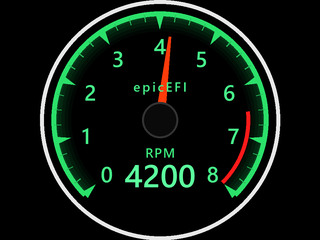
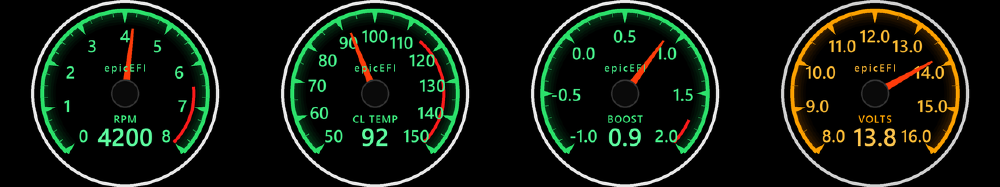

# ESP32 2.8" Gauge

An **ESP32-2432S028R** ("CYD") 2.8" touch display turned into an automotive
instrument.

The dial is drawn from scratch into an RGB565 framebuffer — **no graphics
library** — and pushed to the panel as whole frames. It runs at **34.5 fps**
on the 320×240 ST7789V panel.



---

## Status

| | |
|---|---|
| Panel | ST7789V 240×320 IPS, SPI, driving at 80 MHz |
| Touch | XPT2046 resistive, its own SPI bus; tap cycles instruments |
| Firmware | 367 KB, 82 % of the 2 MB app slot free |
| Frame rate | **34.5 fps** delivered (7.0 ms render + 19.3 ms panel flush) |
| Tests | 82 host unit tests + 33 contract checks, all passing |
| Graphics | none — a framebuffer and about 600 lines of drawing code |

The gauge currently shows a tachometer with a boot self-test sweep and an
engine simulator. Temperature, boost and battery presets are wired up and
switchable at runtime (console or touch).

## Why there is no LVGL

The first version of this project (on the round 1.28" board) used LVGL 9.6. It
worked, but the panel only ever painted part of the dial — whole sectors stayed
black, or went black a fraction of a second after being drawn correctly.

A solid white fill drawn straight into a framebuffer fills the panel edge to
edge and rock steady. That was the whole answer: **the fault was LVGL's
partial-flush path**, not the panel, the wiring or the power. Dropping it made
the firmware 61 % smaller (869 KB → 337 KB) and the display perfect.

Everything here is plain C on one framebuffer. The full reasoning, including
what was ruled out along the way, is in [`docs/hardware.md`](docs/hardware.md).

## Hardware

| | |
|---|---|
| Board | ESP32-2432S028R ("CYD") |
| SoC | ESP32-D0WD-V3, dual-core LX6 @ 240 MHz, no PSRAM |
| Flash | 4 MB GigaDevice GD25Q32 |
| Display | ST7789V IPS, 240×320, 4-wire SPI — driven in 320×240 landscape |
| Touch | XPT2046 resistive, SPI |
| USB | CH340 → UART0 on GPIO1/3 (COM port, 115200) |

Display pins: **SCK 14, MOSI 13, MISO 12, CS 15, DC 2, RST tied to EN,
backlight 21.**
Touch pins: **SCK 25, MOSI 32, MISO 39, CS 33, IRQ 36.**

The listing for this board claims an ILI9341; the panel that arrived is an
ST7789V. Both are selectable under menuconfig — see
[`docs/hardware.md`](docs/hardware.md) for how that was discovered and what
each wrong setting looks like.

## Layout

```
firmware/
  components/
    bsp/     SPI, the ST7789V/ILI9341 panel, backlight, XPT2046 touch
    gfx/     RGB565 framebuffer, primitives, generated bitmap fonts
    gauge/   gauge_math / theme / presets   pure C, host-tested
             gauge_render.c                 draws into the gfx surface
  main/      application: console, gauge driver, touch, bring-up screens
tests/
  host/      unit tests, run on the desktop against a stubbed panel
  py/        contract checks on the generated artefacts
tools/
  test.ps1            run every suite
  idf.bat             run idf.py with the toolchain environment loaded
  gen_font.py         rasterise the fonts -> gfx/gfx_font_data.c
  render_preview.py   host-rendered dial mock-ups
  probe.py            identify the board / dump chip info
  flash.ps1           flash and monitor in one command
docs/
  hardware.md      what the board is, how it was discovered, what was wrong
  development.md   toolchain, build, flash, tests, design notes
```

## Quick start

```powershell
tools\test.ps1                  # host tests + contract checks, ~2 s

tools\idf.bat build

# the CH340's DTR/RTS lines are wired to EN/IO0, so flashing is automatic:
tools\idf.bat -p COM49 flash monitor
```

`tools\flash.ps1` wraps that into one command. No button presses are ever
needed — unlike the round board this project was ported from.

## Console

The REPL comes up on the USB serial port **before** the display is touched, so a
dead panel can never lock you out.

| Command | What it does |
|---|---|
| `help` | List commands |
| `gauge` | List instruments; `gauge temp` switches |
| `demo on\|off\|sweep` | Engine simulator, or replay the self-test sweep |
| `value 4200` | Drive the needle directly (stops the simulator) |
| `fps` | Delivered frame rate + render/flush split; `fps off` hides the readout |
| `touch` | Touch state; `touch watch [s]` prints live raw samples for calibration |
| `backlight 0-100` | Backlight duty |
| `test fill\|bars\|grid\|circle\|quad` | Bring-up test screens |
| `next` | Cycle test screens |
| `flush` | Panel transfer statistics |
| `bootloader` | Reboot into ROM download mode (recovery path) |
| `free` / `version` | Heap usage / build info |

`test fill` is the one worth remembering: a solid white screen is the fastest
way to tell a panel problem from a drawing problem. The frame-rate readout is
also drawn on the dial itself, under the numeric value.

## Tests

```powershell
tools\test.ps1                  # host + contracts
tools\test.ps1 -Filter render   # one suite
```

`gfx` talks to the panel through exactly one function, so **the framebuffer and
the whole gauge renderer are tested on the desktop** with the SPI stubbed out.
That is where the bugs get caught: the host tests found a real one where every
glyph was drawn one ascent too low, which on the panel showed up as the bottom
of the "6" disappearing into the green band behind it.

See [`tests/README.md`](tests/README.md).

## Adding a gauge

Everything that distinguishes one instrument from another lives in
`gauge_config_t`. Add a preset in
[`gauge_presets.c`](firmware/components/gauge/gauge_presets.c):

```c
static const gauge_config_t s_oil_temp = {
    .caption         = "OIL TEMP",
    .wordmark        = "epicEFI",
    .min             = 40.0f,
    .max             = 160.0f,
    .major_step      = 20.0f,
    .minor_per_major = 4,
    .alarm_from      = 130.0f,     /* warning band start; > max for none  */
    .decimals        = 0,
    .slew_time       = 2.5f,       /* slow, damped movement               */
    .theme           = &gauge_theme_greddy,
};
```

Register it in `s_presets[]` and it appears in the `gauge` console command and
in the touch rotation. `tools\test.ps1` then picks it up automatically: the
preset tests build a dial for every entry and check the geometry is
self-consistent.

To see it before flashing, add the same preset to
`tools/render_preview.py` and run it — a contract check fails if the two lists
drift apart.

## Visual design

The dial is a homage to the classic 1990s Japanese instrument look, with the
details that make it read as one:

| Feature | How it is done |
|---|---|
| Green rail | a continuous arc at the outer edge, never interrupted |
| Warning sector | a **separate arc set inboard of the ticks**, not a recolour of them |
| Major ticks | **wedges pointing at the centre**, flat edge on the rail |
| Minor ticks | thin radial lines |
| Numerals | generated bitmap font, centred on cap height |
| Needle | tapered polygon rotated about the dial centre, with a counterweight tail |
| Branding | `epicEFI` above the hub |

The dial is a 240 px circle centred in the wider 320×240 panel; the 40 px side
margins are left black, ready for a future info strip.

`tools/render_preview.py` renders every preset on the host so the design can be
reviewed without flashing — the four instruments side by side:



## Roadmap

- [x] Board bring-up, toolchain, gauge renderer, RPM demo
- [x] No-graphics-library rewrite
- [x] Host tests for the renderer and the drawing primitives
- [x] Touch bring-up: tap to change instrument
- [ ] Real data: CAN / OBD-II / analogue inputs
- [ ] Persist gauge selection and touch calibration in NVS
- [ ] Use the side margins for a digital read-out / warning strip
- [ ] SD card (GPIO 18/19/23/5) for logging
